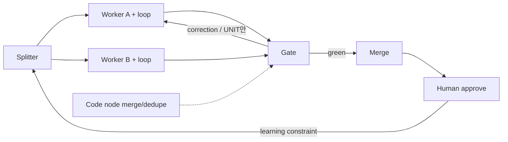

**한 줄:** 루프는 **한 단위를 스스로 고치게** 하고, 그래프는 **어떤 단위가 존재할지** 정한다. 사람은 중간 검열이 아니라 **머지(승인)** 에만 선다.

[@hanakoxbt](https://x.com/hanakoxbt)의 X 아티클 [Loops and Graphs: how to stop babysitting agents and only approve the last step (full course)](https://x.com/hanakoxbt/status/2091515787366306154)(2026-08-23)을 개념이 쌓이는 순서로 다시 짠 학습 메모다. 설치·프레임워크 클릭은 다루지 않는다.  
**초안 작성·문장 정리에 AI를 사용했다.** 해석은 작성자 것이며 원문과 다를 수 있다. 표·샘플·조건문·핸즈온 템플릿은 **공개 아티클·랜딩에 나온 것**만 옮긴다. 유료 코스(`/course.html`)의 설정 파일·역할 프롬프트 전문은 복제하지 않는다.

- 출처: https://x.com/hanakoxbt/status/2091515787366306154
- 작성자: Hanako (@hanakoxbt) — AI researcher
- 원제: Loops and Graphs: how to stop babysitting agents and only approve the last step (full course)
- 관련 코스(원문 링크): https://agent-layers.vercel.app
- (참고) 공개 반응 수치 — 좋아요 1,123 · 북마크 4,307 · 노출 약 4.03M · RT 153 · 답글 33 (X API, 게시물 시점 메타)

## 이 글이 푸는 문제

에이전트가 한 스텝을 밟을 때마다 사람이 들여다본다. 원하면 그렇게 하는 게 아니라, **밖에서 실패를 잡아 줄 장치가 없어서**다. 그 의자에서 내려오려면 두 가지가 필요한데, 대부분 **하나만** 만든다.

| | 루프 (loop) | 그래프 (graph) |
|---|---|---|
| 하는 일 | **한 단위**를 네가 없어도 맞게 만든다 | **어떤 단위가 존재할지**·순서·병렬·회신을 정한다 |
| 사는 곳 | 노드 **안** | 노드 **사이** |
| 없으면 | 스케줄러(돌리기만 함) | 잘 만든 한 스텝이 설계 없는 줄에 섬 |
| 흔한 실패 | 체크 없이 “리뷰 모델”만 붙임 | “그리고 나서”를 전부 의존으로 착각 |

모델만 세게 바꿔도, 단위 정의와 실패 조건이 없으면 **중간 검열**은 사라지지 않는다.

## 루프: 실패할 수 있는 체크가 본체다

원문이 루프를 네 조각으로 줄인다. **produce → check → correct → repeat until green.** 본체는 check다. 네가 자리를 비운 뒤에도 일을 **실패로 판정**할 수 없으면 루프가 아니라 스케줄러다.

조건은 **프로그램이 평가할 수 있게** 먼저 쓴다. 원문 예시:

| GREEN (체크다) | NOT A CHECK (체크가 아니다) |
|---|---|
| 테스트 스위트가 exit 0 | 출력이 좋아 보인다 |
| 모든 주장에 출처 줄이 있다 | 모델이 자신 있다고 말한다 |
| diff가 계획에 적힌 파일만 건드린다 | 에러가 안 났다 |

마지막 칸이 함정이다. **에러 없음 ≠ 올바름.** 그런 “체크” 위에 루프를 올리면, 예산이 바닥날 때까지 **같은 실수를 자신 있게 반복**하고 로그만 깨끗해진다. “리뷰용 모델 하나 더”도 원문은 **두 낙관주의자의 합의**로 본다.

## 루프만의 천장

루프는 **한 단위를 더 좋게** 만드는 데 매우 강하다. 그게 전부다. 어떤 단위가 존재해야 하는지, 순서가 맞는지, 다섯 스텝 중 둘이 **서로 기다릴 필요가 없는지**는 루프 안에서 결정할 수 없다.

그래서 “매 스텝은 맞는데 전체는 느리고 모양이 틀린” 상태가 나온다. 루프를 더 튜닝해도 안 고쳐진다 — 고장은 **단위 안**에 없기 때문이다. 이때 사람들은 모델을 탓하고, 원문은 그 순간이 **다음 층(그래프)** 이 값을 내기 시작한다고 본다.

## 그래프: 일의 모양

그래프는 일의 모양이다. 무엇이 돌고, 무엇이 동시에 돌고, 무엇이 기다리고, 무엇이 **아예 안 돌며**, 결과가 어디로 돌아가는지.

부품은 둘뿐이다.

- **노드 (node):** 경계 있는 한 일. 입력 하나, 출력 하나.
- **엣지 (edge):** 의존. 이 노드의 출력이 저 노드의 입력이 된다.

낭비의 전형은 **「그리고 나서」를 엣지로 취급**하는 것이다. “파일 요약하고 나서 날씨 보기”는 날씨가 요약을 **소비하지 않으면** 엣지가 없다. 타이핑 순서로 묶인 **독립 노드 둘**이다. 이미 있는 파이프라인의 화살마다 묻는다. **다음 스텝이 이전 출력의 어떤 변수를 실제로 읽는가?** 이름을 못 대면 엣지가 없고, 그 대기는 순수 낭비다. 원문은 대부분의 체인에 그런 화살 두세 개가 있고, 찾는 일이 종종 **가장 큰 단일 속도 향상**이라고 한다.

## 네 종류의 노드 (하나는 모델이 아니다)

어휘는 넷이다. **Splitter · Worker · Code node · Gate.**

| 노드 | 역할 | 원문이 짚는 함정 |
|---|---|---|
| **Splitter** | 앞에서 일을 단위로 자른다 | 자르는 축이 틀리면 아래가 전부 낭비. 폴더로 자르면 네 워커가 **같은 파일 셋**을 감사할 수 있고, **blast radius**로 자르면 각자 다른 것을 본다 |
| **Worker** | 단위 하나 · 렌즈 하나 · **자기 컨텍스트** | 창을 공유하면 수렴한다. 첫 발견을 읽고 네 리포트가 같은 중심으로 모인다 — **한 의견에 세 메아리**, 네 번 비용 |
| **Code node** | 병합·랭킹·중복 제거·전후 비교 | 추론이 아니다. 정답이 하나고 몇 줄이면 된다. 모델에 태우면 비용·지연·분산만 늘어난다. *judge / decide / assess / summarize* 없이 설명할 수 있으면 코드 |
| **Gate** | 통과·반려 | 없으면 그래프는 **검증 안 된 출력을 더 빨리** 만드는 장치 |

한 문장으로 위치를 고정한다. **루프는 노드 안, 그래프는 노드 사이.**  
루프 없는 그래프 = 병렬로 더 많은 미검증 출력. 그래프 없는 루프 = 설계되지 않은 줄 위의 아주 좋은 한 스텝.

## 두 개의 되돌림 길

되돌아갈 길이 없으면 파이프라인이다. 출력을 만들고 잊는다. 다음 주도 같은 맹점에서 시작한다.

| | Correction edge (짧음) | Learning edge (김) |
|---|---|---|
| 하는 일 | Gate가 **한 단위**를 만든 스텝으로 반려 → **이번 런** 고침 | 수락된 결과에서 뽑은 **제약**이 Splitter 브리프로 → **이후 모든 런** 고침 |
| 실어 나르는 것 | 단위 수정 | 출력이 아니라 제약 |
| 안 만들면 | (대부분 이것만 만듦) | 빠르지만 **절대 안 똑똑해지는** 시스템 |

원문 샘플(학습 엣지가 나르는 것):

- ACCEPTED — utils 슬라이스 포팅, 첫 패스에 green  
- DERIVED — adapters는 keyword args를 정확히 보존  
- LANDS IN — **이후 모든 슬라이스의 Splitter 브리프** (워커 지시문이 아님)

확인된 원인이 규칙이 되어, 다음 고장은 **이번이 끝난 곳**에서 시작한다.

## 단위를 돌려보내고, 배치를 통째로 돌리지 말 것

네 슬라이스를 포팅했는데 하나만 테스트 실패. 배치 전체를 되돌리면 **이미 맞던 셋**도 다시 쓰인다. 다음 버전은 “더 나음”이 아니라 “다름”이고, 네 개를 다시 검증하다 **원래 맞던 것이 다른 이유로 실패**할 수 있다. 실패 하나를 불확실 네 개로 바꾸고 비용을 낸다. 겉으로는 모델이 계속 실패하는 것처럼 보이지만, **되돌림 경로가 올바른 일을 부수는** 구조다.

되돌림에 같이 가는 넷(원문):

| 필드 | 예 |
|---|---|
| UNIT | handlers slice |
| VERDICT | red |
| REASON | test_auth_redirect failed |
| EVIDENCE | expected 302, got 200, `handlers/auth.py:88` |
| SCOPE | 이 파일만 고치고 다른 슬라이스는 건드리지 말 것 |

SCOPE가 없으면 에이전트가 옆 이슈까지 고쳐 **한 슬라이스 교정이 네 파일 diff**가 된다. 시도는 **세 번**으로 캡. 세 번 실패하면 문제는 루프가 못 보는 **플랜** 쪽에 가깝다.

## 게이트: 자신감이 아니라 blast radius

많은 글은 confidence 점수와 임계값을 만든다. 원문은 그걸 **틀린 변수**라고 한다. 자신감은 모델이 **스스로 흔들 수 있는** 유일한 입력이라 가장 약하다. 강한 변수는 **틀렸을 때 되돌리기 비용**이다.

| 레인 | 예 | 게이트 |
|---|---|---|
| 되돌리기 쉽고 범위 작음 | 카피 변경, 테스트, 커버리지 있는 고립 함수 | 먼저 열 수 있음 (나쁜 머지 = revert) |
| 되돌리기 쉽지만 범위 넓음 | 공용 유틸, 스키마 추가, 호출자 다수 | 결정적 체크 + 깨끗한 trajectory |
| 되돌리기 어려움 | 마이그레이션, 삭제, 프로덕션 데이터·돈 | **점수와 무관하게 레인 자체를 안 연다** |

“임계값을 아주 높게”와 “닫힌 레인”은 다르다. 임계값은 조정되고, 닫힌 레인은 안 열린다.

열린 레인 안에서 Gate가 증거를 읽는 순서(원문): **결정적 결과 → 이번 런 trajectory → 이 노드 작업이 과거에 롤백된 빈도 → 모델 자체 평가(마지막).**

## 어디에 사람을 둘까

반복하는 일 하나를 골라 Splitter · 레인 · Merge · Gate · 되돌림 엣지를 그린다. **Gate를 먼저** 만든다. 크게 실패할 수 있어야 나머지가 쉬워지고, Gate 없는 그래프는 미검증 출력을 가속하는 장치다. 그다음 레인, **학습 엣지는 마지막** — 수락되는 결과가 있어야 제약을 뽑을 수 있다.

사람은 **결과 파급이 크고 되돌리기 어려운 지점**에 둔다. **머지를 승인**하고, 어떤 수정이 나갈지 고른다. 중간 출력 리뷰·매 스텝 확인이 아니다. 그래프 한가운데 사람이 앉으면 그 사람이 **가장 느린 노드**가 되고, 그래프 속도는 읽는 속도에 묶인다.

원문이 남기는 세 줄:

1. 도착한 답만이 아니라 **경로**를 재라.  
2. 다음 실행을 바꾸지 않는 판정은 **리포트**일 뿐이다.  
3. 영구 제약으로 안 만든 실패는 **다시 만난다.**

## 핸즈온: 네 일로 한 바퀴 그리기

원문 순서: **Gate 먼저 → 레인 → 학습 엣지 마지막.** 아래는 공개 글에 적힌 조각으로 만든 **따라 할 워크시트**다. 도구·프레임워크 설치는 필요 없다. 메모장·이슈 한 장이면 된다.

### 0) 오늘 고를 일 하나

반복하는 일 한 줄만 적는다. (예: “PR에 auth 리다이렉트 버그 고치기”, “리포 폴더 감사”, “문서 섹션 포팅”)

```
TASK: _______________________________
왜 매번 내가 중간을 보나?: _______________________________
```

### 1) 루프 체크 템플릿 (프로그램이 판정)

원문 GREEN / NOT A CHECK를 네 TASK에 맞게 채운다. **모델 자신감·“좋아 보임”은 넣지 않는다.**

```
# loop_check.md
GOAL: (한 단위가 끝나야 하는 상태)

GREEN:
- [ ] ________________  (예: 테스트 exit 0)
- [ ] ________________  (예: 주장마다 출처 줄)
- [ ] ________________  (예: diff ⊆ plan 파일 목록)

NOT A CHECK (쓰지 말 것):
- 출력이 좋아 보인다 / 모델이 자신 있다 / 에러가 안 났다

MAX_ATTEMPTS: 3
ON_3_FAILS: 플랜(Splitter 브리프) 재검토 — 루프가 플랜을 못 봄
```

**채워 넣은 예 (원문 handlers 샘플을 루프에 얹은 것):**

```
GOAL: handlers 슬라이스의 auth 리다이렉트 테스트 green
GREEN:
- [ ] pytest … exit 0
- [ ] test_auth_redirect: expected 302 (지금은 200 @ handlers/auth.py:88)
- [ ] diff는 handlers/auth.py 만 (계획에 적힌 파일)
MAX_ATTEMPTS: 3
```

### 2) 미니 그래프 스케치

원문 어휘만 쓴다. Splitter → Workers(+ 각자 루프) → Gate → Merge. 사람과 학습 엣지 위치도 표시한다.



**엣지 감사 (원문 질문):** 파이프라인의 화살마다 “다음이 **이전 출력의 어떤 변수**를 읽는가?” — 이름 못 대면 엣지 삭제(순수 낭비).

| 화살 | 넘기는 변수 이름 | 실의존? |
|---|---|---|
| A → B | ________ | Y / N |
| B → C | ________ | Y / N |

가짜 예 (원문): “파일 요약 → 날씨” — 날씨가 요약을 안 읽으면 **N**, 병렬 가능.

### 3) Splitter 브리프 템플릿

자르는 축을 고른다. 원문 대비: **폴더 컷** vs **blast radius 컷**.

```
# splitter_brief.md
CUT_BY: folder | blast_radius | other: ____
UNITS:
- id: ____  scope: ____  lens: ____
- id: ____  scope: ____  lens: ____
SHARED_CONTEXT: no   # 원문: 창 공유 시 네 감사가 한 의견+세 메아리
CONSTRAINTS_FROM_LEARNING:  # 학습 엣지가 쌓이는 곳
- (비어 있어도 됨 — 첫 런)
```

**예 (원문 대비를 채운 것):**

| CUT_BY | 결과 (원문) |
|---|---|
| folder | 네 워커가 **같은 세 파일**을 중복 감사할 수 있음 |
| blast_radius | 각자 다른 것을 보고, 서로를 완전히 대체하지 못함 |

### 4) Worker 단위 카드

```
# worker_unit.md
UNIT_ID: handlers
LENS: auth redirect only
OWN_CONTEXT: yes
INPUT: plan files = [handlers/auth.py]
OUTPUT: patch + test result
LOOP: loop_check.md 참조
```

### 5) Code node 체크리스트 (모델에 안 맡길 것)

원문: *judge / decide / assess / summarize* 없이 설명되면 코드.

```
[ ] merge / rank / dedupe / before-after export compare
[ ] “한 정답, 몇 줄”인가?
→ YES면 Code node. 모델에 태우지 말 것.
```

### 6) Correction 페이로드 템플릿 (배치 통째 반려 금지)

```
UNIT: ________________
VERDICT: red | green
REASON: ________________
EVIDENCE: ________________  (파일:줄, expected vs got)
SCOPE: 이 단위만. 다른 슬라이스 금지.
```

**원문 예 그대로:**

```
UNIT: handlers slice
VERDICT: red
REASON: test_auth_redirect failed
EVIDENCE: expected 302, got 200, handlers/auth.py:88
SCOPE: fix this file only, do not touch other slices
```

네 슬라이스 중 하나만 red면 **하나만** 되돌린다. 맞은 셋을 다시 쓰게 하지 않는다.

### 7) Learning 엣지 템플릿 (수락 후에만)

```
ACCEPTED: ________________  (무엇이 green이었나)
DERIVED: ________________   (다음 컷에 넣을 제약 한 줄)
LANDS_IN: splitter_brief.CONSTRAINTS_FROM_LEARNING
# 워커 지시문이 아니라 Splitter 브리프에 꽂는다 (원문)
```

**원문 예:**

```
ACCEPTED: utils slice ported, green on first pass
DERIVED: adapters preserve keyword args exactly
LANDS_IN: splitter brief for every later slice
```

### 8) Gate · blast radius 레인 배정

네 UNIT을 세 레인에 놓는다.

| UNIT | 레인 (contained / wide / hard) | 자동 오픈? | 증거 순서 |
|---|---|---|---|
| ____ | ____ | Y/N | 1 결정적 → 2 trajectory → 3 과거 롤백 → 4 모델 평가(마지막) |
| ____ | ____ | Y/N | 같음 |
| ____ | hard | **N (닫힘)** | 점수 무관 — 사람/머지 |

**핸즈온 미니 시나리오 (원문 재료 조합):**

1. 네 슬라이스 포팅. handlers만 `test_auth_redirect` red.  
2. Correction은 handlers **UNIT만** + SCOPE.  
3. 세 번 안에 green이면 Merge 후보.  
4. 사람이 **머지 승인**.  
5. Learning: “adapters preserve keyword args”를 Splitter 브리프에 추가.  
6. 다음 슬라이스 컷부터 그 제약이 기본값.

### 9) 사람 자리 한 줄

```
HUMAN_STEP: Merge 승인 / 어떤 수정이 나갈지 선택
NOT_HUMAN: 중간 출력 전부 리뷰, 매 스텝 확인
```

가운데 앉으면 그래프 속도 = 읽는 속도(원문).

### 10) 다섯 레이어 지도 (코스 랜딩 공개 요약)

아티클이 가리키는 코스 랜딩([agent-layers.vercel.app](https://agent-layers.vercel.app))은 레이어를 다섯으로 쌓는다. **아래가 없으면 위가 못 고친다**는 주장이다. (상세 템플릿·설정은 유료 `/course.html` — 여기선 공개 한 줄만.)

| Layer | 고치는 것 | 없으면 (랜딩 문구) |
|---|---|---|
| Prompt | 메시지 | 매번 다른 추측 |
| Context | 창에 들어오는 것 | 같은 파일을 네 번 읽고도 모름 |
| Harness | 도구·권한·파싱·재시도·트레이스 | 데모는 되고 프로덕션 첫 이상에 죽음 |
| Loop | run→check→correct | 네가 매일 같은 실수 클래스를 손으로 고침 |
| Graph | 병렬·대기·백엣지·게이트·사람 자리 | 스무 에이전트가 돌아도 실질은 직렬×비용 |

랜딩이 예시로 드는 **그래프 모양**(이름만, 설정 없음): 프롬프트→완성 PR(에이전트 여섯) · 검색자 다섯→출처 있는 리포트 · 코드베이스 감사(~20분). 따라 돌릴 config는 코스 쪽.

## 한계

핸즈온 절의 빈칸·예는 공개 아티클 문장을 **워크시트로 재구성**한 것이다. 유료 코스의 config·역할 프롬프트·전체 다이어그램은 복제하지 않는다. 프레임워크 설치는 논외(원문·랜딩: `agent-layers.vercel.app`). 노출·북마크 수는 인기 지표일 뿐 주장의 증명은 아니다. “Gate만 만들면 자동 머지”처럼 읽으면 장르를 놓친다 — 닫힌 레인·SCOPE·학습 엣지가 같이 있어야 한다.

## 남는 한 줄

루프만 튜닝하며 시스템이라 부르는 쪽과, 루프 **둘레에 그래프를 그리는** 쪽의 차이다. 후자는 플릿을 돌리고, 전자는 왜 뒤처지는지 잘 모르는 상태에 가깝다(원문의 마무리 톤).

*학습용 정리. AI 보조 작성.*
